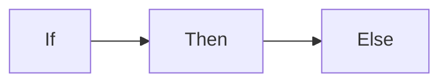

+++
title = 'Personal'
date = 2023-09-25T09:38:19+02:00
draft = false
mermaidInitialize = "{ \"theme\": \"dark\" }"
mermaidZoom = true
+++

## Attachments

{}

## Badge

{}Prueba{}
{}Prueba{}
{}
{}

## Button

{}**Prueba**{}
{}{}

## Expand

{}...................................................................................................{}
{}No need to press you!{}

## Icon

{}
{}
{}

## Include

Inlude incluye otros archivos .md dentro de la pagina actual, pueden contener lenguaje markdown y sera tenido en cuenta al cargar el contenido de la pagina.

## Math


$$\left( \sum_{k=1}^n a_k b_k \right)^2 \leq \left( \sum_{k=1}^n a_k^2 \right) \left( \sum_{k=1}^n b_k^2 \right)$$


```math
$$\left( \sum_{k=1}^n a_k b_k \right)^2 \leq \left( \sum_{k=1}^n a_k^2 \right) \left( \sum_{k=1}^n b_k^2 \right)$$
```

## Mermaid




---
title: Example Diagram
---
graph LR;
    A[Hard edge] -->|Link text| B(Round edge)
    B --> C{<strong>Decision</strong>}
    C -->|One| D[Result one]
    C -->|Two| E[Result two]


## Notice

{}
It is all about the boxes.
{}

{}
A **warning** disclaimer
{}

## Tab

{}
```c
printf("Hello World!");
```
{}

{}
A tab can not only contain code but arbitrary text. In this case text **and** code will get a margin.
```python
printf("Hello World!");
```
{}

## Highlight


# the hardest part is to start writing code; here's a kickstart; just copy and paste this; it's free; the next lines will cost you serious credits
print("Hello")
print(" ")
print("World")
print("!")
